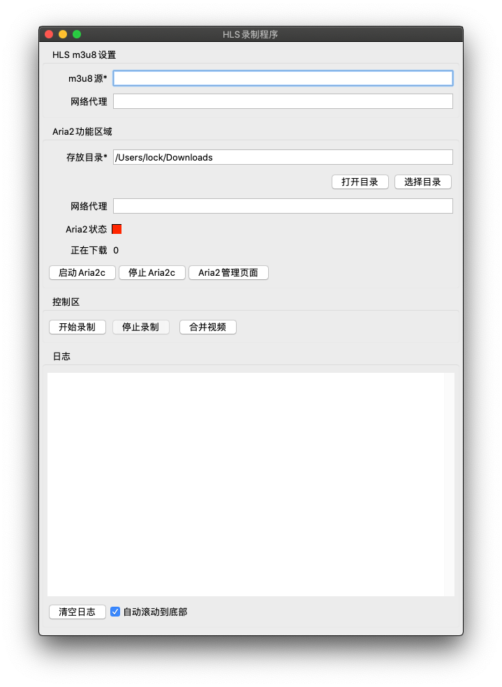
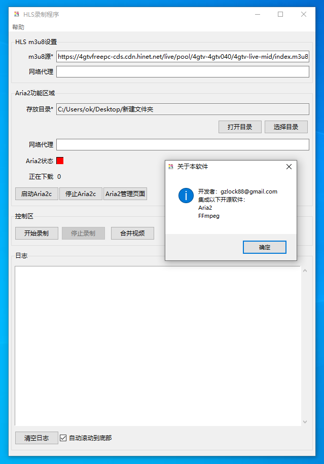

# HLS视频录制GUI工具

### 特性
- 支持可变分辨率的VOD和Live的HLS m3u8资源
- 默认会选取最高分辨率的分支进行录制
- HLS的ts视频碎片使用集成的Aria2进行下载，安全可靠
- 支持Windows和macOS系统
- 视频文字水印功能，在随机的视频碎片，上下左右四个角落随机一个角落放置文字水印
- 使用集成的FFMpeg合并视频

### 不支持
- 加密的m3u8流
- 独立音轨的m3u8流

### 一体化
- 集成Aria2c，下载HLS的视频碎片
- 集成FFmpeg，将HLS的视频碎片合并为完整视频

### 工作流程
1. 点击开始录制按钮
1. 读取一次m3u8源判断m3u8源和代理(如果有设置)的可用性
1. 不断读取m3u8源，分析出还没有下载的碎片视频链接数组
1. 将没有下载的碎片视频链接数组交给Aria2下载
1. 点击停止录制按钮
1. 使用合并视频功能将视频碎片合并为完全的视频文件

### 测试情况
* 在macOS系统上测试通过
* 在Windows 10.v2004上测试通过

### 截图

### 自行编译
- Windows和macOS在命令行执行命令 `pyinstaller main.spec --clean -y`

### 已知问题
- 启动慢，是pyinstaller的问题，无法解决
- 在macOS系统，输入框不能输入中文(macOS自带的输入法)，安装新版的Tcl/tk也不行，找不到解决办法

### About FFMpeg and Aria2
- FFMpeg v4.2.2 downloaded from https://ffmpeg.zeranoe.com/builds/
- Aria2 v1.35.0 downloaded from https://github.com/aria2/aria2

